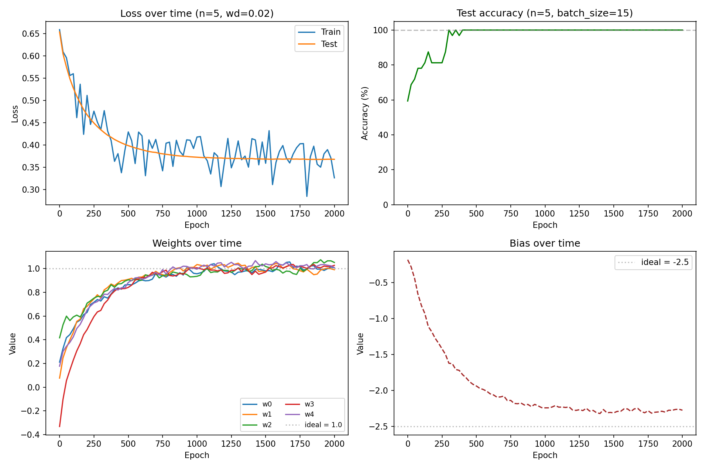
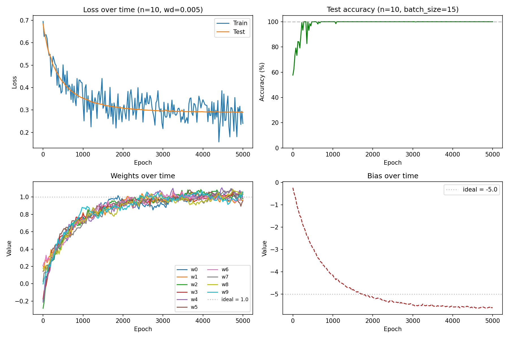
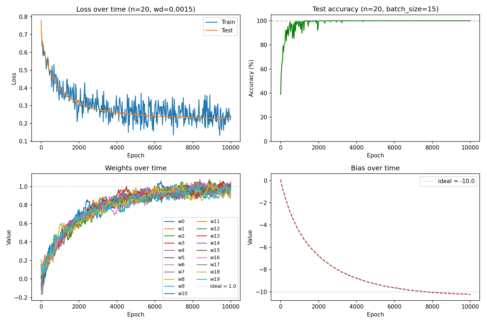

# Majority Function Perceptron

I was browsing Artificial Intelligence by Stuart Russell and they mention an example of a single-layer perceptron trained to learn the majority function. I thought this could be fun to code up in pyTorch from scratch (using vim haha) to see what it looks like. (Check out page 731 for more info on the description.)

## What is the majority function?

The majority function outputs 1 if more than half of its binary inputs are 1, and 0 otherwise. For example, with 5 inputs: `[1, 1, 1, 0, 0]` → 1 (three out of five), but `[0, 1, 1, 0, 0]` → 0 (two out of five).

This is a linearly separable problem, so a single perceptron can learn it. The ideal solution has all weights equal to 1 and bias equal to −n/2 (as described in Russell & Norvig, p. 731).

## How it works

The model is a single `nn.Linear` layer trained with `BCEWithLogitsLoss` and SGD. The dataset is exhaustive — all 2ⁿ possible binary inputs with their correct labels.

L2 regularization (`weight_decay`) is used to prevent the weights from inflating indefinitely (a property of logistic regression on separable data) and to push them toward the clean theoretical values.

## Running

```bash
uv run main.py
```

Adjust `n` and `weight_decay` at the top of `__main__` to experiment.

## Results

As `n` increases, training takes longer and the weight decay must be reduced to allow the bias to reach −n/2. In all cases the model achieves 100% accuracy and converges toward the ideal weights.

### n=5, weight_decay=0.02



Weights converge to ~1.0, bias to ~−2.3 (ideal: −2.5). Reaches 100% accuracy within ~400 epochs.

### n=10, weight_decay=0.005



Weights converge to ~1.0, bias to ~−5.0 (ideal: −5.0). Reaches 100% accuracy within ~500 epochs.

### n=20, weight_decay=0.0015



Weights converge to ~1.0, bias approaching −10.0 (ideal: −10.0). Reaches 100% accuracy within ~1000 epochs but the bias takes longer to fully settle.

## Key takeaways

In the end, to get the weights and bais to converge to the "ideal" values laid out in Russell, we had to add a weight decay. Not sure this is actually useful if we were training a real NN, but I guess it serves as a protection against overfiting. In this case, since its a deterministic and learnable, we don't care as much about overfitting. 